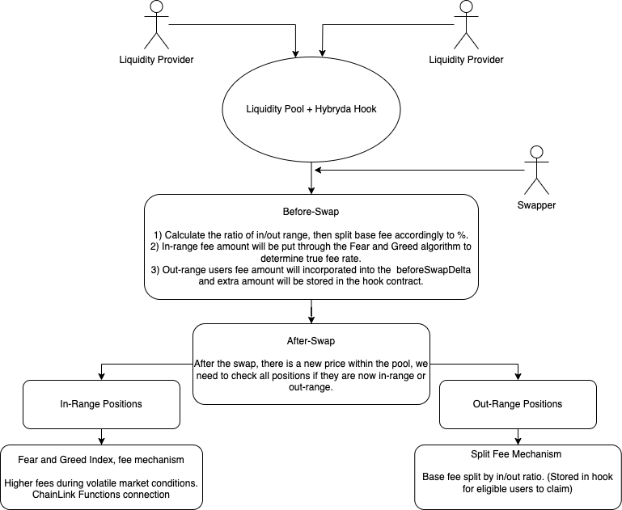

# Hybryrda Hook

## Introduction

Welcome to Hybryrda Hook which is my capstone project for the Atrium x Uniswap Hook Cohort.

## Problems Being Solved

Firstly I would like to mention the two issues that I am trying to solve:

1. Liquidity Pools have no outside connection, and liquidity providers are not rewarded enough for taking enough risk for providing liquidity during volatile times when they are subject to risk-like impermanent loss.

2. Even though concentrated liquidity has introduced more efficient fees, without the need of providing liquidity at full price range. However a lot of dexes have dead capital involved and the thought of being a power user and constantly rebalancing your positions seems like an issue to potential new LPs that want to enter the space or crypto noobies who only HODL, but that's capital we are trying to attract to our platforms.

## How It Works

This hook keeps track of all the positions within the pools and tracks if they are inRange and during the after-swap function checks the current tick compared to the upper and lower of the positions within the pool. This is important for my hook to track these changes as it has two different fee functions depending on the ranges.

### In-Range Fee Mechanism

Firstly for the users who are inRange their fee accumulation methods will depend on the Fear and Greed Index and an algorithm which boils down to more fees during extreme fear/greed and slightly more during normal fear/greed. This aims to solve the issue of liquidity pools being in their own bubbles and not paying out enough fees for liquidity providers which are offering liquidity during volatile and risky times for them.

### Out-of-Range Fee Mechanism

Secondly for the users who are out of range there is also a fee accumulation method. This works by taking the base fee of 0.5% and splitting it according to total outRange/inRange liquidity within the contract and the time so let's say 60% inRange for 40% outRange. Therefore 0.3 base fee would be used and put through the FearNGreed algorithm while 0.2% would be added to the modified beforeSwapDelta, then excess tokens would be stored in the hook contract ready for withdrawal for eligible users.

This feature aims to tackle the concept of 'dead capital' introduced by concentrated liquidity dexes, and generate user fees even though out of range. Hopefully improving the LPs chances of rebalancing remembering the inRange methodology is more capital efficient.

### Flow Diagram



## Tests

There are 3 test files which test different features of my hook:

1. DynamicFees.t.sol tests the Fee Rate for the inRange users using the Fear and Greed index, the test is a mock of what would happen when the CoinMarketCap API is called to get the current FnG index, to accomplish this we use the 'vm.store' cheat code, to change the state variable to see how it affects the FnG fee algorithm.

2. FeesCollected.t.sol is for assessing if the hook is collecting fees via the beforeSwapDelta. It does this by first by simulating a few swaps going both ways to accumulate both tokens. Then we test the claimFees function for the outRange users and to see if the mapping accounting of everyone's share of the fees works accordingly.

3. TrackingPositions.t.sol file is for assessing wherever the positions are tracked in the hook correctly. It tests the add/remove liquidity functions.

4. AfterSwap.t.sol test file is dedicated to test the afterSwap function. This is an important test as after each swap it should track and reccently reorder users who fell out of range, and users who fell into range.

## Future Roadmap

For the future roadmap I would like to keep building this hook, I would need to learn how to backtest hooks on data to see and where my hook can be imporoved, continue working on my hook slowly getting it ready for an audit. I would also like to consider using Arbitrum Stylus as there's a lot of gas intensive features in my hook contract also that is something I didn't have the chance of attempting during this cohort because of time and personal responsibilities.

## Installation

```bash
# Clone the repository
git clone https://github.com/yourusername/hybryrda-hook.git
cd hybryrda-hook

# Install dependencies
forge install

# Compile the contracts
forge build

# Run tests
forge test
```

## Links

1. Presentation Slides: https://www.canva.com/design/DAGgVZV_gfM/nx37V1cF1Qg4XaFElQmrAg/edit?utm_content=DAGgVZV_gfM&utm_campaign=designshare&utm_medium=link2&utm_source=sharebutton

2. Demo:
